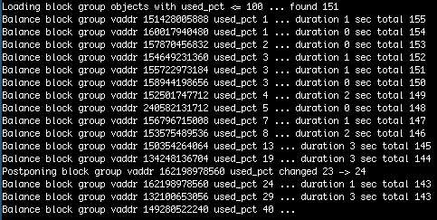
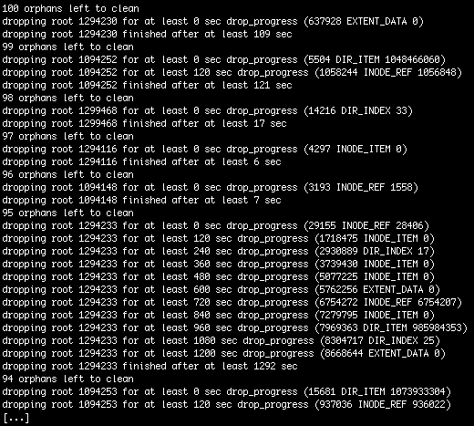
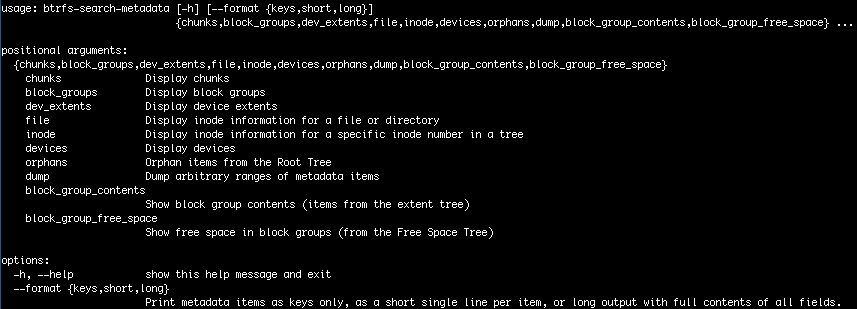
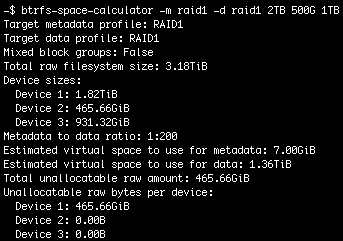
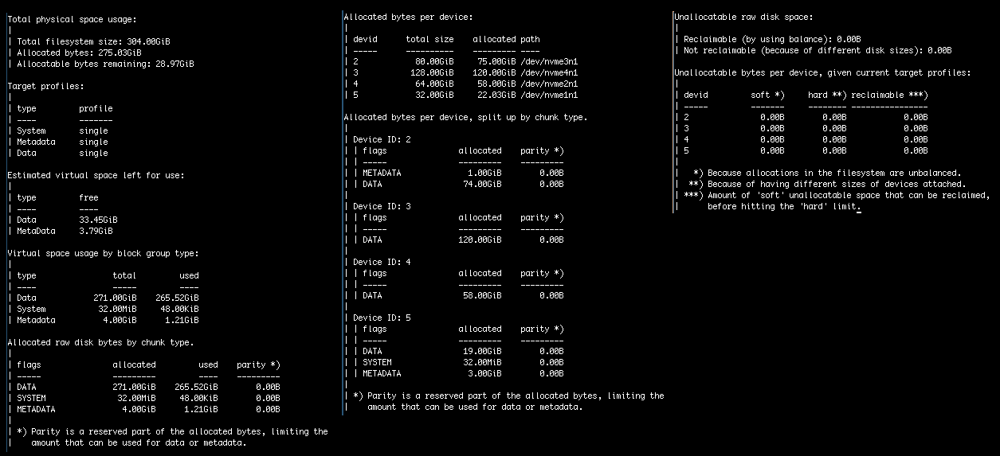
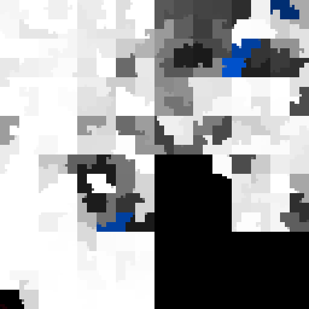

Python btrfs gallery
====================

This page lists software that uses the Python btrfs library:
 * The programs included in the `bin/` directory of this project
 * `btrfs-heatmap`, which has its own repository
 * Any 3rd party software that likes to be listed and provides some information... :-)

### btrfs-balance-least-used

The [`btrfs-balance-least-used`](../bin/btrfs-balance-least-used) program
implements a modified algorithm for using btrfs balance to compact allocated
space (i.e. defragment free space) as fast and efficient as possible by taking
the usage ratio of the individual allocations of raw disk space into account.

### btrfs-orphan-cleaner-progress

When deleting subvolumes, the
[`btrfs-orphan-cleaner-progress`](../bin/btrfs-orphan-cleaner-progress) shows
progress of the cleanup that happens in the background.

### btrfs-search-metadata

[`btrfs-search-metadata`](../bin/btrfs-search-metadata) can be used to execute
search queries in order to look up metadata items of an online, mounted btrfs
filesystem. Unlike the btrfs inspect-internal dump-tree command, which directly
reads from disk, btrfs-search-metadata only uses the kernel SEARCH ioctl
function.

Besides being able to get any metadata slice from any tree, there are a number
of convenience presets that execute predefined search queries.

### btrfs-space-calculator

The [`btrfs-space-calculator`](../bin/btrfs-space-calculator) program shows the
amount of allocatable space on btrfs physical and virtual level, and the amount
of unallocatable space resulting from having differently sized block devices
added to the filesystem.

In a btrfs filesystem, raw storage is shared by data of different types
(System, MetaData and Data) and profiles (e.g. single, DUP, RAID1). Also,
a filesystem can have multiple block devices of different sizes attached.

### btrfs-usage-report

[`btrfs-usage-report`](../bin/btrfs-usage-report) uses the usage reporting part
of python-btrfs to show a detailed overview about how a btrfs filesystem is
using available disk space.

### btrfs-heatmap

[`btrfs-heatmap`](https://github.com/knorrie/btrfs-heatmap/) creates a
visualization of how a btrfs filesystem is using the underlying disk space of
the block devices that are added to it.

This program was originally developed together with the first steps for the
python-btrfs library, to be able to visualize the contents of DATA block groups
in a filesystem in order to debug btrfs extent allocator behaviour.

## 3rd party programs using python-btrfs

### btrfs-balance-exclude-devid

[`btrfs-balance-exclude-devid`](https://github.com/wrighrc/btrfs-balance-exclude-devid)
by Charles Wright balances block groups that don't have a stripe on the
excluded devid. It is based on the `btrfs-balance-least-used` program.
