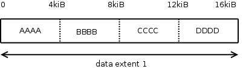
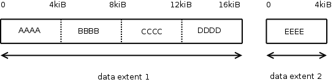
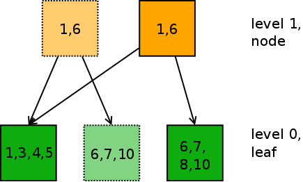

Cows, Moo!
==========

Btrfs is a COW, or "copy on write" filesystem. This means that the filesystem
always writes new or changed data in a new place, and never directly overwrites
existing data.

This COW principle is applied to different parts of the filesystem in different
ways. The main objectives are:
* Protecting the filesystem against corruption when interruptions during disk
  writes occur: If new writes fail to complete, we always can go back to the
  previous known good situation.
* Enabling features like snapshotting and cloning of single files and entire
  directory hierarchies: If we write changes in a different place, we make sure
  we don't change the result of reading an older snapshot of the same file.

I'll now explain a few different scenarios in which COW is used in btrfs.
_Don't worry if half of it doesn't still make sense to you yet after reading.
The important part is to know that these concepts exist and are implemented.
Later on in the tutorial, when we'll be seeing things like these actually
happening for real in our filesystem, we'll examine them in more depth._

COW for data
------------

Actual file data is stored in "extents". We'll see extents in more detail later
when we get to have a look at the extent tree in btrfs metadata. For now, we'll
look at a simplified example. Let's assume we write a new 16kiB file, which
contains 4kiB of AAAA, then 4kiB of BBBB, then CCCC and finally some DDDD. If
we just write this at once, btrfs will probably place it in one "extent" on
disk:

Now, if we want to replace the 4kiB of CCCC with EEEE a day later, we can open
the file and write 4kiB of EEEE at the 8kiB offset inside the file. Only, btrfs
will not change the 16kiB data extent we created yesterday. It will put our new
4kiB write in a new extent:

When reading back the file afterwards, behind the scenes, btrfs will combine
data from the original and new data extent and it will just seem like the AAAA
BBBB EEEE and DDDD are contiguous in the file.

When changing a file, we also have to update the metadata about the file, for
example by changing the information about last modified timestamp. By first
writing the changed data in a new place, and then updating the metadata, btrfs
can assure that in case of a crash or power outage, we will either see the old
version of the file again, or the new version, but never an inconsistent
combination of changes that have partly been applied.

COW for metadata
----------------

In the previous page about [trees](trees.md) we learned that metadata in btrfs
is stored in little 16kiB blocks, which are organized in a tree structure. When
making a change to metadata, for example when creating, deleting or renaming a
file or directory, the information in a leaf changes.

Instead of directly changing the leaf in place, a modified copy of the current
leaf is written to some other 16kiB of empty space. However, if there's a node
that point to this leaf, then we also need to change the node to point to the
new leaf. Instead of changing the node in place, we write a new copy of the
node, which contains the pointer to the new leaf to some currently empty space.
This process repeats itself for every node in a higher level of the tree until
we reach the top.

The following picture shows that we have to write out new versions of a leaf
and a node when adding the key value 8 with an item to the tree:

Metadata COW |
:---------:|
|

Again, writing copies with the new changes in a different place makes sure that
if our computer crashes half way making the changes, we will lose the changes
we were writing, but at least we can continue with the last known good state of
our filesystem.

Note: You might wonder how btrfs will find the new top level node after we
wrote it to a different place. Actually, in reality, there's even more changes
going on. There's another tree which has a pointer to the top of this tree, and
there is a filesystem superblock placed above that. To not make everything too
complicated already, we ignore this for now.

COW for data enables snapshotting of files
------------------------------------------

The example above in the 'COW for data' section already shows that when writing
changes to a different location, we keep the original data intact. When
snapshotting single files (e.g. with the `cp --reflink` command) this makes it
possible to keep changing the file, while the older snapshot will still show
the previous contents.

We'll see more of this in the tutorial section about snapshot and reflinks.

COW for metadata enables snapshotting an entire filesystem
----------------------------------------------------------

Actually snapshotting and cloning are technically the same thing in btrfs. When
making a snapshot of an entire filesystem tree (subvolume) we just write out a
copy of the top node of the tree, with the same pointers to lower tree blocks,
and give it a new tree number. Any change that is made to any file or directory
in the cloned tree will automatically unshare the changed parts thanks to the
COW process. And, since the changes to file data are also COWed, we
automatically only reference the changes in our own tree, and other snapshots
will keep seeing the old data.

We'll see more of this in the tutorial section about snapshot and reflinks.

Questions and Exercises
-----------------------

1. The paper ["B-trees, Shadowing, and
   Clones"](https://btrfs.wiki.kernel.org/images-btrfs/6/68/Btree_TOS.pdf)
   contains a lot more information about how COW changes to trees can be
   implemented. You might find this an interesting read.

Up: [Overview](README.md)
