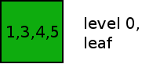
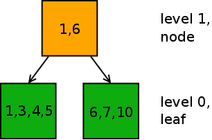
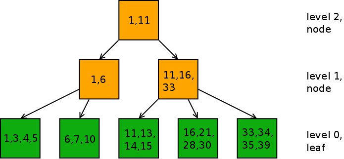
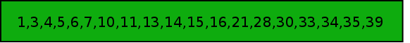

Trees
=====

The first thing that likely comes to mind when hearing about a "Filesystem
Tree" is a hierarchical directory structure:

    .
    ├── bin
    │   └── bash
    ├── etc
    │   └── passwd
    ├── lib
    └── usr
        ├── lib
        └── local

    6 directories, 2 files

However, when talking about btrfs trees, this is not what we're looking for.

Btrfs metadata trees
--------------------

Btrfs uses a tree data structure as storage format for all kinds of metadata of
the file system. Metadata consists of all information in the filesystem that is
not actually the contents of our files. That means information about a
directory stucture like shown above, about file names and modification dates,
information about where the actual data of files is placed on disk, so that we
can find them back while reading them later etc. etc...

A metadata tree is built up by connecting small blocks of metadata storage
together. The most simple tree possible exists of just one leaf:

Single Level Tree |
:---------:|
|

Normally such a leaf is a 16 kiB block of metadata, containing an ordered list
of key and value pairs. To keep everything simple, I've only put the key values
in the picture above. The keys are just numbers, and the values are actually
called "items". Items can be of many different types. Examples of item types
are a DirItem, which contains a file or directory name, or a DevItem, which
contains information about a disk (block device) that is attached to the
file system.

While my example only shows 4 keys, a typical 16kiB btrfs leaf likely can
contain up to a few hundred key and item pairs.

When we run out of space inside the leaf, the tree code splits the list of
values and then adds a level above:

Tree with two levels |
:---------:|
|

Instead of a leaf, this new level contains a different type of tree block,
called a node. The node does not contain actual items like the leaf does, but
only contains information about the first key in each of the leaves below,
together with information about where this leaf can be found.

A simplified picture of a three level tree looks like the picture below. It's
still only the lowest level in the tree that contains leaves with actual item
data.

Tree with three levels |
:---------:|
|

Since the amount of information that needs to be stored in a node per child
leaf or node is very small, a full 16kiB node can contain up to almost 500
references to child leaves.

So, a typical real btrfs tree will be much wider than this example and will
look much more similar to an upside down acacia tree than a larch!

A tree or just a long list?
---------------------------

When looking at level 0 of any tree, we see that if we put all leaves after
each other, we actually get a long list of key and item pairs:

All keys and items as a list |
:---------:|
|

The kernel API for a running filesystem does not contain functionality to
retrieve information about the internal tree structure. The information about
which nodes are connected to each other, or which key and item live in exactly
which leaf is hidden for us.

Instead, the view that the kernel provides on the tree is just a long linear
list of all keys and item values in the leaves, and a search function that
allows retrieving keys and items in a subrange of the list.

Questions and Exercises
-----------------------

1. Tree sizes...

   Imagine an example filesystem in which the nodes and leaves in our metadata
   are all 16kiB big. Every node and leaf has a 40 byte header in the
   beginning. A reference in a node to a child node or child leaf costs 33
   bytes of space. We are looking at a filesystem tree containing the metadata
   about files which exist in our btrfs filesystem. In the filesystem, we start
   creating files and directories. Assume that the metadata for a single file
   or directory entry takes up 200 bytes of space inside a leaf.

   How many files could we theoretically store in this btrfs subvolume before
   the filesystem tree really needs to grow to a three level tree?

2. Look up documentation about B-tree, B+ tree and related data structures, and
   name a few differences between the btrfs tree data structure and each of
   them. Hint: don't make this too complicated, notice difference in where keys
   and values are placed in the tree, and how nodes and leaves link to each
   other.

Next: [Cows](cows.md)  
Up: [Overview](README.md)
